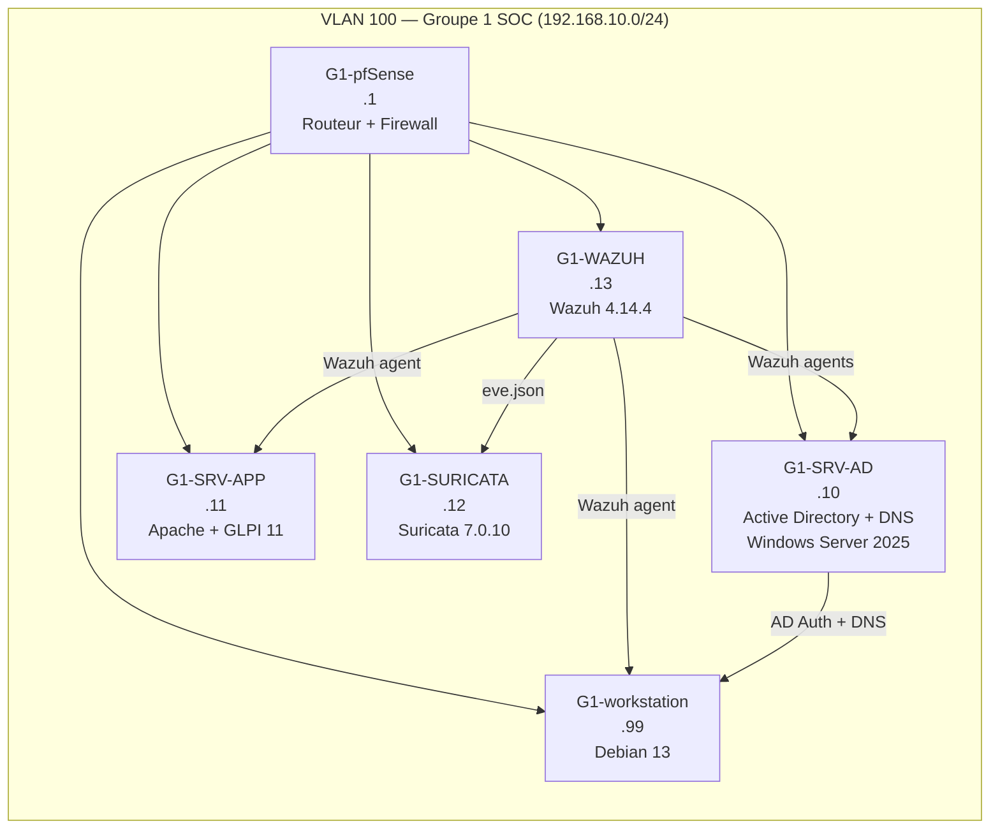

# sysadmin-toolkit

> A practical collection of sysadmin scripts, Ansible playbooks, and infrastructure documentation — built from real-world lab work and enterprise administration experience.

[](https://learn.microsoft.com/en-us/powershell/)
[](https://www.ansible.com/)
[](.)
[](LICENSE)

## What's in here

This repository covers three areas:

| Area | Tools | What it solves |
|------|-------|----------------|
| **Active Directory** | PowerShell + RSAT | User lifecycle, security audits, GPO exports |
| **Linux hardening** | Ansible + auditd | CIS baseline deployment, log centralization |
| **Lab documentation** | Markdown + Mermaid | Network design, AD structure, IR playbooks |

Everything here comes from building and running the [fil rouge lab](#lab-infrastructure) — a full enterprise simulation on KVM/libvirt with 6 VMs, pfSense, Wazuh SIEM, and Active Directory.

---

## PowerShell Scripts — Active Directory

All scripts require the `ActiveDirectory` RSAT module (`GroupPolicy` for GPO scripts).  
Run in **PowerShell 5.1+** on a domain-joined machine or with `-Server` targeting.

### User & Access Management

| Script | Purpose | Key Parameters |
|--------|---------|----------------|
| [`Get-ADUserAudit.ps1`](powershell/active-directory/Get-ADUserAudit.ps1) | Full user export: last logon, groups, password status, OU | `-ExportCsv`, `-IncludeDisabled` |
| [`New-UserOnboarding.ps1`](powershell/active-directory/New-UserOnboarding.ps1) | Complete user provisioning in <60 seconds | `-FirstName`, `-LastName`, `-Department`, `-HomeSharePath` |
| [`Get-InactiveObjects.ps1`](powershell/active-directory/Get-InactiveObjects.ps1) | Find stale users/computers (90+ days) | `-DaysInactive`, `-DisableObjects` |

```powershell
# Full user audit to CSV
.\Get-ADUserAudit.ps1 -ExportCsv "C:\Reports\ad-audit.csv"

# Onboard a new employee
.\New-UserOnboarding.ps1 -FirstName "Alice" -LastName "Martin" -Department "IT" -HomeSharePath "\\srv-file01\homes"

# Find and disable accounts inactive for 60+ days
.\Get-InactiveObjects.ps1 -DaysInactive 60 -ObjectType Users -DisableObjects
```

### Security Auditing

| Script | Purpose | MITRE Coverage |
|--------|---------|----------------|
| [`Get-ADSecurityAudit.ps1`](powershell/active-directory/Get-ADSecurityAudit.ps1) | Identifies: DA bloat, password never expires, unconstrained delegation, Kerberoasting candidates | T1078, T1558.003, T1003 |
| [`Export-GPOReport.ps1`](powershell/active-directory/Export-GPOReport.ps1) | Exports all GPOs to HTML (individual + index) | — |

```powershell
# Security audit with HTML output
.\Get-ADSecurityAudit.ps1 -ExportHtml "C:\Reports\ad-security-$(Get-Date -Format yyyyMMdd).html"

# GPO full inventory
.\Export-GPOReport.ps1 -OutputPath "D:\Audits\GPO-$(Get-Date -Format yyyyMMdd)"
```

### Monitoring

| Script | Purpose | Key Parameters |
|--------|---------|----------------|
| [`Get-DiskAlert.ps1`](powershell/monitoring/Get-DiskAlert.ps1) | Multi-server disk space monitoring with thresholds | `-ComputerName`, `-ThresholdPercent`, `-EmailTo` |
| [`Get-ServiceStatus.ps1`](powershell/monitoring/Get-ServiceStatus.ps1) | Critical service health check with optional auto-restart | `-ComputerName`, `-ServiceNames`, `-AutoRestart` |

```powershell
# Check disk space on multiple servers
.\Get-DiskAlert.ps1 -ComputerName "DC01","SRV-FILE01" -ThresholdPercent 20 -ExportHtml "C:\Reports\disk.html"

# Service health check with email alert
.\Get-ServiceStatus.ps1 -ComputerName (Get-Content servers.txt) -ExportCsv "C:\Reports\services.csv"
```

### Hardening

| Script | Purpose | Framework |
|--------|---------|-----------|
| [`Invoke-WindowsHardening.ps1`](powershell/hardening/Invoke-WindowsHardening.ps1) | CIS-aligned baseline: SMBv1, LLMNR, NTLMv2, LSASS PPL, WDigest, RDP NLA, UAC, audit policy | CIS Benchmark, MITRE T1110, T1557 |

```powershell
# Preview all changes before applying
.\Invoke-WindowsHardening.ps1 -WhatIf

# Apply full hardening baseline
.\Invoke-WindowsHardening.ps1
```

---

## Ansible Playbooks — Lab Fil Rouge

Targets: Debian 13 Trixie (4 VMs Linux) + pfSense 2.8. Requires Ansible 2.14+ on the control node.

```bash
# Prérequis — collections et dépendances Python
ansible-galaxy collection install -r ansible/requirements.yml
pip install pywinrm[kerberos]

# Configurer l'inventaire (adapter les IPs / ports si nécessaire)
# ansible/inventory/groupe1.yml

# Créer le vault pour les credentials
ansible-vault create ansible/group_vars/vault.yml

# Exécuter les playbooks dans l'ordre (depuis ansible/)
ansible-playbook playbooks/01-configuration-initiale.yml
ansible-playbook playbooks/02-configuration-reseau.yml
ansible-playbook playbooks/03-deploiement-vnc-xfce4.yml
ansible-playbook playbooks/04-deploiement-suricata.yml
ansible-playbook playbooks/05-deploiement-wazuh.yml
ansible-playbook playbooks/06-deploiement-applications.yml
ansible-playbook playbooks/07-configuration-pfsense.yml

# Cibler un hôte spécifique
ansible-playbook playbooks/01-configuration-initiale.yml --limit g1-srv-app

# Mode dry-run
ansible-playbook playbooks/01-configuration-initiale.yml --check
```

| Playbook | Cible | Ce qu'il fait |
|----------|-------|---------------|
| [`01-configuration-initiale.yml`](ansible/playbooks/01-configuration-initiale.yml) | groupe1 | Màj système, paquets de base, hostname, NTP (pfSense), UFW |
| [`02-configuration-reseau.yml`](ansible/playbooks/02-configuration-reseau.yml) | groupe1 | Config réseau statique via templates (network-interface.j2, resolv.conf.j2) |
| [`03-deploiement-vnc-xfce4.yml`](ansible/playbooks/03-deploiement-vnc-xfce4.yml) | groupe1 | TigerVNC port 5901 + XFCE4 sur les 4 VMs Linux |
| [`04-deploiement-suricata.yml`](ansible/playbooks/04-deploiement-suricata.yml) | g1-suricata | Suricata 7.0.10 IDS via apt, règles suricata-update |
| [`05-deploiement-wazuh.yml`](ansible/playbooks/05-deploiement-wazuh.yml) | g1-wazuh + groupe1 | Wazuh 4.14.4 all-in-one + 4 agents + règles SOC personnalisées |
| [`06-deploiement-applications.yml`](ansible/playbooks/06-deploiement-applications.yml) | g1-srv-app + groupe1 | GLPI 11.0.6 (Apache2 + MariaDB) + GLPI Agent 1.11 sur toutes les VMs |
| [`07-configuration-pfsense.yml`](ansible/playbooks/07-configuration-pfsense.yml) | g1-pfsense | DNS Unbound, DHCP LAN (.100–.200), 10 règles firewall via pfsensible |

---

## Lab Infrastructure

This toolkit was built alongside the **fil rouge lab** — a 6-VM SOC simulation on KVM/libvirt (B3 CPI program, Groupe 1).



**Full documentation:**
- [Lab overview](lab/README.md) — VM specs, deployment order, integrations
- [AD structure](lab/ad-structure.md) — OU tree, GPOs, group naming, DNS zones
- [Wazuh rules](lab/wazuh-custom-rules.md) — Custom detection rules with MITRE mapping
- [VLAN design](network/vlan-design.md) — Network diagram and firewall rules
- [pfSense baseline](network/pfsense-baseline.md) — Full firewall configuration reference

---

## Documentation

| Document | Description |
|----------|-------------|
| [Incident Response — AD Compromise](docs/incident-response-ad.md) | Kerberoasting, DA account creation, Pass-the-Hash — triage, containment, eradication |

---

## Repository Structure

```
sysadmin-toolkit/
├── ansible/
│   ├── ansible.cfg                        # Config Ansible (inventory, SSH, privilege escalation)
│   ├── requirements.yml                   # Collections requises (community.mysql, pfsensible.core)
│   ├── inventory/
│   │   └── groupe1.yml                    # Inventaire fil rouge (tunnels SOCAT + pfSense + AD)
│   ├── group_vars/
│   │   └── all.yml                        # Variables globales (vault pour credentials)
│   ├── templates/
│   │   ├── network-interface.j2           # Config interface réseau statique
│   │   ├── resolv.conf.j2                 # Configuration DNS
│   │   ├── suricata.yaml.j2               # Configuration Suricata IDS
│   │   └── ossec.conf.j2                  # Config agent Wazuh (+ eve.json sur g1-suricata)
│   └── playbooks/
│       ├── 01-configuration-initiale.yml  # Paquets, hostname, NTP, UFW
│       ├── 02-configuration-reseau.yml    # Réseau statique via templates
│       ├── 03-deploiement-vnc-xfce4.yml   # TigerVNC + XFCE4
│       ├── 04-deploiement-suricata.yml    # Suricata 7.0.10
│       ├── 05-deploiement-wazuh.yml       # Wazuh 4.14.4 + agents + règles SOC
│       ├── 06-deploiement-applications.yml # GLPI 11.0.6 + GLPI Agent
│       └── 07-configuration-pfsense.yml   # pfSense DNS/DHCP/firewall via pfsensible
├── powershell/
│   ├── active-directory/                  # AD user management, security audits, GPO
│   ├── monitoring/                        # Disk and service monitoring
│   └── hardening/                         # Windows security baseline
├── network/
│   ├── vlan-design.md                     # Architecture réseau VLAN 100, tunnels SOCAT
│   └── pfsense-baseline.md                # Configuration pfSense référence
├── lab/
│   ├── README.md                          # Vue d'ensemble lab, VMs, accès
│   ├── it-server-setup.md                 # Socle hôte KVM — bridges, hook VLAN, SOCAT
│   ├── ad-structure.md                    # AD g1soc.local — OUs, groupes, GPO
│   └── wazuh-custom-rules.md              # Règles SOC personnalisées + mapping MITRE
└── docs/
    └── incident-response-ad.md            # IR playbook — AD compromise
```

---

## Author

**Aymerick Victoire** — Sysadmin & Network | Security Engineering track  
[LinkedIn](https://linkedin.com/in/aymerick-victoire-41796820a) · [soc-quest](https://github.com/AymerickVic/soc-quest)

> *This repo documents real skills built through hands-on lab work. All scripts are tested in the fil rouge lab environment.*
