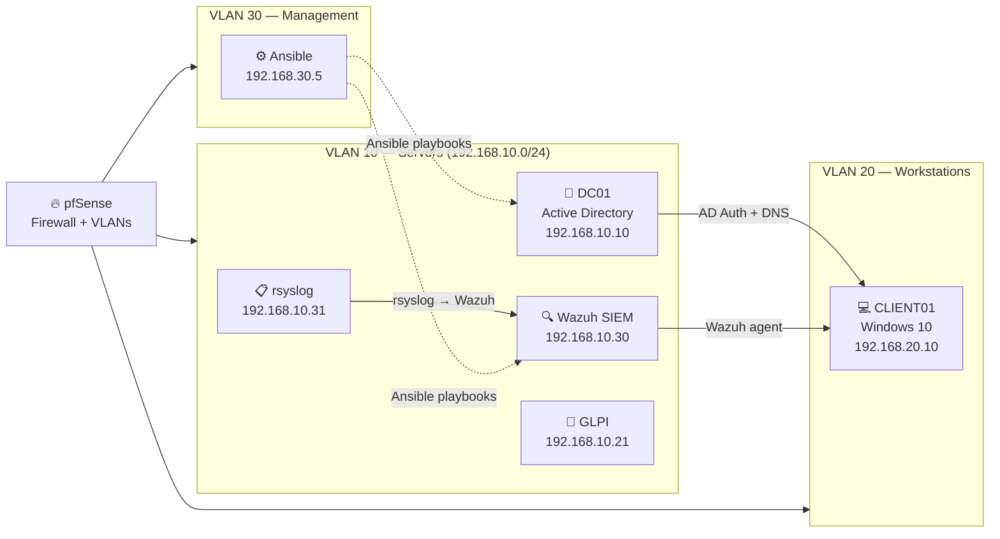

# sysadmin-toolkit

> A practical collection of sysadmin scripts, Ansible playbooks, and infrastructure documentation — built from real-world lab work and enterprise administration experience.

[](https://learn.microsoft.com/en-us/powershell/)
[](https://www.ansible.com/)
[](.)
[](LICENSE)

## What's in here

This repository covers three areas:

| Area | Tools | What it solves |
|------|-------|----------------|
| **Active Directory** | PowerShell + RSAT | User lifecycle, security audits, GPO exports |
| **Linux hardening** | Ansible + auditd | CIS baseline deployment, log centralization |
| **Lab documentation** | Markdown + Mermaid | Network design, AD structure, IR playbooks |

Everything here comes from building and running the [fil rouge lab](#lab-infrastructure) — a full enterprise simulation on KVM/libvirt with 6 VMs, pfSense, Wazuh SIEM, and Active Directory.

---

## PowerShell Scripts — Active Directory

All scripts require the `ActiveDirectory` RSAT module (`GroupPolicy` for GPO scripts).  
Run in **PowerShell 5.1+** on a domain-joined machine or with `-Server` targeting.

### User & Access Management

| Script | Purpose | Key Parameters |
|--------|---------|----------------|
| [`Get-ADUserAudit.ps1`](powershell/active-directory/Get-ADUserAudit.ps1) | Full user export: last logon, groups, password status, OU | `-ExportCsv`, `-IncludeDisabled` |
| [`New-UserOnboarding.ps1`](powershell/active-directory/New-UserOnboarding.ps1) | Complete user provisioning in <60 seconds | `-FirstName`, `-LastName`, `-Department`, `-HomeSharePath` |
| [`Get-InactiveObjects.ps1`](powershell/active-directory/Get-InactiveObjects.ps1) | Find stale users/computers (90+ days) | `-DaysInactive`, `-DisableObjects` |

```powershell
# Full user audit to CSV
.\Get-ADUserAudit.ps1 -ExportCsv "C:\Reports\ad-audit.csv"

# Onboard a new employee
.\New-UserOnboarding.ps1 -FirstName "Alice" -LastName "Martin" -Department "IT" -HomeSharePath "\\srv-file01\homes"

# Find and disable accounts inactive for 60+ days
.\Get-InactiveObjects.ps1 -DaysInactive 60 -ObjectType Users -DisableObjects
```

### Security Auditing

| Script | Purpose | MITRE Coverage |
|--------|---------|----------------|
| [`Get-ADSecurityAudit.ps1`](powershell/active-directory/Get-ADSecurityAudit.ps1) | Identifies: DA bloat, password never expires, unconstrained delegation, Kerberoasting candidates | T1078, T1558.003, T1003 |
| [`Export-GPOReport.ps1`](powershell/active-directory/Export-GPOReport.ps1) | Exports all GPOs to HTML (individual + index) | — |

```powershell
# Security audit with HTML output
.\Get-ADSecurityAudit.ps1 -ExportHtml "C:\Reports\ad-security-$(Get-Date -Format yyyyMMdd).html"

# GPO full inventory
.\Export-GPOReport.ps1 -OutputPath "D:\Audits\GPO-$(Get-Date -Format yyyyMMdd)"
```

### Monitoring

| Script | Purpose | Key Parameters |
|--------|---------|----------------|
| [`Get-DiskAlert.ps1`](powershell/monitoring/Get-DiskAlert.ps1) | Multi-server disk space monitoring with thresholds | `-ComputerName`, `-ThresholdPercent`, `-EmailTo` |
| [`Get-ServiceStatus.ps1`](powershell/monitoring/Get-ServiceStatus.ps1) | Critical service health check with optional auto-restart | `-ComputerName`, `-ServiceNames`, `-AutoRestart` |

```powershell
# Check disk space on multiple servers
.\Get-DiskAlert.ps1 -ComputerName "DC01","SRV-FILE01" -ThresholdPercent 20 -ExportHtml "C:\Reports\disk.html"

# Service health check with email alert
.\Get-ServiceStatus.ps1 -ComputerName (Get-Content servers.txt) -ExportCsv "C:\Reports\services.csv"
```

### Hardening

| Script | Purpose | Framework |
|--------|---------|-----------|
| [`Invoke-WindowsHardening.ps1`](powershell/hardening/Invoke-WindowsHardening.ps1) | CIS-aligned baseline: SMBv1, LLMNR, NTLMv2, LSASS PPL, WDigest, RDP NLA, UAC, audit policy | CIS Benchmark, MITRE T1110, T1557 |

```powershell
# Preview all changes before applying
.\Invoke-WindowsHardening.ps1 -WhatIf

# Apply full hardening baseline
.\Invoke-WindowsHardening.ps1
```

---

## Ansible Playbooks — Linux

Targets: Debian 12 / Ubuntu 22.04 servers. Requires Ansible 2.14+ on the control node.

```bash
# Run against all Linux servers
ansible-playbook -i ansible/inventory/hosts.yml ansible/playbooks/01-debian-hardening.yml

# Deploy Wazuh agent (uses ansible-vault for registration password)
ansible-playbook -i ansible/inventory/hosts.yml ansible/playbooks/02-deploy-wazuh-agent.yml --ask-vault-pass

# Configure centralized log forwarding
ansible-playbook -i ansible/inventory/hosts.yml ansible/playbooks/03-configure-rsyslog.yml
```

| Playbook | What it does |
|----------|-------------|
| [`01-debian-hardening.yml`](ansible/playbooks/01-debian-hardening.yml) | SSH hardening, sysctl (ASLR, SYN cookies), UFW, fail2ban, auditd rules, pwquality |
| [`02-deploy-wazuh-agent.yml`](ansible/playbooks/02-deploy-wazuh-agent.yml) | Installs and registers Wazuh 4.9 agent to manager |
| [`03-configure-rsyslog.yml`](ansible/playbooks/03-configure-rsyslog.yml) | Configures rsyslog TCP forwarding to central syslog server |

---

## Lab Infrastructure

This toolkit was built alongside the **fil rouge lab** — a full enterprise simulation used during the B3 CPI program.



**Full documentation:**
- [Lab overview](lab/README.md) — VM specs, deployment order, integrations
- [AD structure](lab/ad-structure.md) — OU tree, GPOs, group naming, DNS zones
- [Wazuh rules](lab/wazuh-custom-rules.md) — Custom detection rules with MITRE mapping
- [VLAN design](network/vlan-design.md) — Network diagram and firewall rules
- [pfSense baseline](network/pfsense-baseline.md) — Full firewall configuration reference

---

## Documentation

| Document | Description |
|----------|-------------|
| [Incident Response — AD Compromise](docs/incident-response-ad.md) | Kerberoasting, DA account creation, Pass-the-Hash — triage, containment, eradication |

---

## Repository Structure

```
sysadmin-toolkit/
├── powershell/
│   ├── active-directory/      # AD user management, security audits, GPO
│   ├── monitoring/            # Disk and service monitoring
│   └── hardening/             # Windows security baseline
├── ansible/
│   ├── inventory/             # Hosts file with VLAN-based groups
│   └── playbooks/             # Hardening, Wazuh, rsyslog
├── network/
│   ├── vlan-design.md         # Mermaid network diagram + firewall rules
│   └── pfsense-baseline.md    # pfSense config reference
├── lab/
│   ├── README.md              # Lab overview
│   ├── ad-structure.md        # AD design docs
│   └── wazuh-custom-rules.md  # SIEM detection rules
└── docs/
    └── incident-response-ad.md
```

---

## Author

**Aymerick Victoire** — Sysadmin & Network | Security Engineering track  
[LinkedIn](https://linkedin.com/in/aymerick-victoire-41796820a) · [soc-quest](https://github.com/AymerickVic/soc-quest)

> *This repo documents real skills built through hands-on lab work. All scripts are tested in the fil rouge lab environment.*
