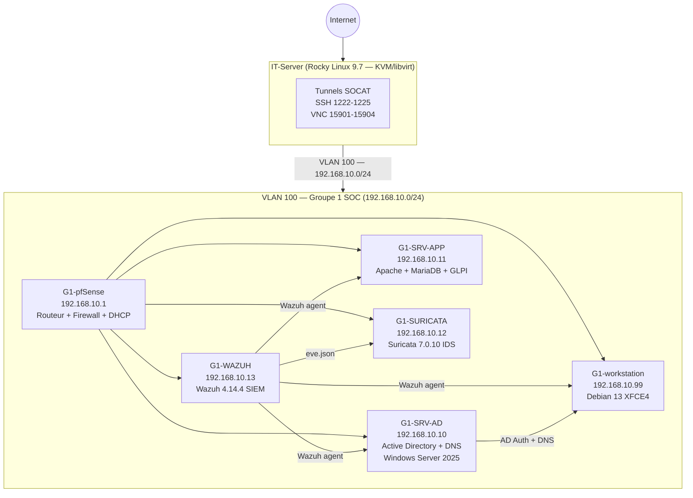

# Architecture Réseau — Lab Fil Rouge Groupe 1

> Infrastructure réseau du lab fil rouge B3 CPI — Groupe 1.
> 6 VMs sur KVM/libvirt, segmentation par VLAN 100 sur pfSense 2.8.

## VLAN

| VLAN ID | Réseau | Passerelle | Usage |
|---------|--------|-----------|-------|
| **100** | 192.168.10.0/24 | 192.168.10.1 (G1-pfSense) | Toutes les VMs Groupe 1 |

> Le lab utilise un **VLAN unique (100)** dédié au Groupe 1.
> L'isolation vis-à-vis des autres groupes est assurée par le bridge `br-g1-lan`
> et le hook libvirt qui tague les interfaces en VLAN 100 automatiquement.

## Diagramme réseau



## Plan d'adressage IP

```
192.168.10.0/24 — VLAN 100 Groupe 1
  .1    G1-pfSense       (passerelle, DHCP, NAT, firewall)
  .10   G1-SRV-AD        (Active Directory, DNS — g1soc.local)
  .11   G1-SRV-APP       (Apache2, PHP 8.4, MariaDB, GLPI 11.0.6)
  .12   G1-SURICATA      (Suricata 7.0.10 IDS)
  .13   G1-WAZUH         (Wazuh 4.14.4 — Manager + Indexer + Dashboard)
  .99   G1-workstation   (Poste client Debian 13 XFCE4)
  .100-.200  Pool DHCP   (plage dynamique — réservations statiques pour les VMs)
```

## Bridges réseau (IT-Server)

| Bridge | Rôle |
|--------|------|
| `br-wan` | Bridge VLAN-aware — WAN (sortie internet, VLAN-trunk) |
| `br-g1-lan` | LAN Groupe 1 — 192.168.10.0/24, VLAN 100 |

**Hook libvirt** (`/etc/libvirt/hooks/qemu`) : attribution automatique du VLAN 100
aux interfaces des VMs Groupe 1 au démarrage :
```bash
bridge vlan add dev vnet1 vid 100 pvid untagged
```

## Tunnels SOCAT (IT-Server → VMs)

Chaque tunnel est un service systemd avec `Restart=always`.

| Port IT-Server | Protocole | Destination |
|----------------|-----------|-------------|
| 1222/tcp | SSH | G1-SRV-APP → 192.168.10.11:22 |
| 1223/tcp | SSH | G1-SURICATA → 192.168.10.12:22 |
| 1224/tcp | SSH | G1-WAZUH → 192.168.10.13:22 |
| 1225/tcp | SSH | G1-workstation → 192.168.10.99:22 |
| 15901/tcp | VNC | G1-SRV-APP → 192.168.10.11:5901 |
| 15902/tcp | VNC | G1-SURICATA → 192.168.10.12:5901 |
| 15903/tcp | VNC | G1-WAZUH → 192.168.10.13:5901 |
| 15904/tcp | VNC | G1-workstation → 192.168.10.99:5901 |

## Isolation inter-groupes

- Chaque groupe a son propre bridge KVM (`br-g1-lan`, `br-g2-lan`, etc.)
- Aucun routage entre bridges — isolation L2 complète
- Validé par tests : 100% packet loss depuis G1 vers les autres groupes (`ping`)

## Choix de conception

**Pourquoi un seul VLAN vs segmentation multi-VLAN ?**

Le guide officiel du projet décrit une architecture multi-VLAN (SRV/PROD/MGMT/WIFI…).
Le lab déploie une version simplifiée avec un VLAN unique (100) pour des raisons pratiques :
- Complexité réduite pour un lab pédagogique
- Isolation inter-groupes garantie par les bridges KVM
- Segmentation interne reportée à la phase de tests pfSense avancés

En environnement de production, les VMs devraient être réparties sur des VLANs dédiés
(AD/Servers/Management/Workstations) avec des règles firewall inter-VLAN strictes.
