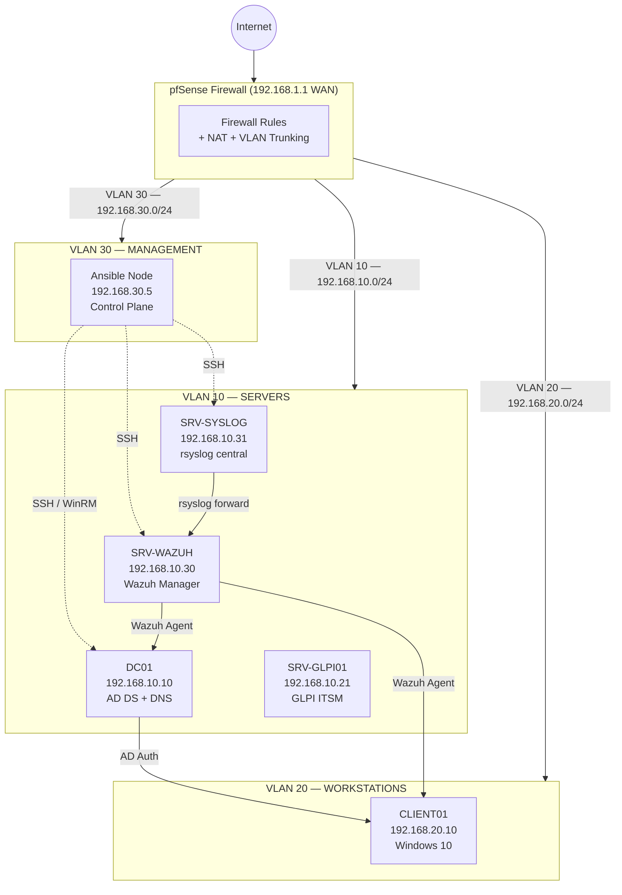

# VLAN Design — Lab Infrastructure

> Architecture réseau du lab fil rouge (B3 CPI) — 6 VMs sur KVM/libvirt avec segmentation par VLAN pfSense.

## VLAN Table

| VLAN ID | Name | Subnet | Gateway | Purpose |
|---------|------|--------|---------|---------|
| 10 | SERVERS | 192.168.10.0/24 | 192.168.10.1 | Domain controllers, servers (AD, Wazuh, GLPI) |
| 20 | WORKSTATIONS | 192.168.20.0/24 | 192.168.20.1 | Client machines (CLIENT01) |
| 30 | MANAGEMENT | 192.168.30.0/24 | 192.168.30.1 | Out-of-band admin access, Ansible control node |
| 99 | DMZ | 192.168.99.0/24 | 192.168.99.1 | *(reserved for future exposure)* |

## Network Diagram



## Firewall Rules Summary

### VLAN 10 → VLAN 20 (Servers → Workstations)
| Proto | Source | Destination | Port | Action | Reason |
|-------|--------|-------------|------|--------|--------|
| TCP | 192.168.10.10/32 | 192.168.20.0/24 | Any | ALLOW | DC → clients (Netlogon, GPO, Kerberos) |
| TCP | 192.168.10.30/32 | 192.168.20.0/24 | 1514 | ALLOW | Wazuh agent communication |
| Any | Any | Any | Any | DENY | Default deny |

### VLAN 20 → VLAN 10 (Workstations → Servers)
| Proto | Source | Destination | Port | Action | Reason |
|-------|--------|-------------|------|--------|--------|
| TCP/UDP | 192.168.20.0/24 | 192.168.10.10/32 | 53 | ALLOW | DNS queries to DC |
| TCP/UDP | 192.168.20.0/24 | 192.168.10.10/32 | 88,389,445,636 | ALLOW | AD (Kerberos, LDAP, SMB) |
| TCP | 192.168.20.0/24 | 192.168.10.21/32 | 80,443 | ALLOW | GLPI access |
| Any | Any | Any | Any | DENY | Default deny |

### VLAN 30 → Any (Management)
| Proto | Source | Destination | Port | Action | Reason |
|-------|--------|-------------|------|--------|--------|
| TCP | 192.168.30.5/32 | 192.168.10.0/24 | 22 | ALLOW | Ansible SSH to Linux servers |
| TCP | 192.168.30.5/32 | 192.168.10.10/32 | 5985,5986 | ALLOW | Ansible WinRM to DC |
| Any | 192.168.30.0/24 | Any | Any | DENY | Restrict management scope |

## IP Address Allocation

```
192.168.10.0/24 — SERVERS
  .1   pfSense VLAN10 gateway
  .10  DC01 (Primary Domain Controller)
  .20  SRV-FILE01 (File Server)
  .21  SRV-GLPI01 (ITSM)
  .30  SRV-WAZUH (SIEM)
  .31  SRV-SYSLOG (Log collector)
  .254 Reserved

192.168.20.0/24 — WORKSTATIONS
  .1   pfSense VLAN20 gateway
  .10  CLIENT01 (static — domain-joined test workstation)
  .100-.200 DHCP pool (dynamic clients)

192.168.30.0/24 — MANAGEMENT
  .1   pfSense VLAN30 gateway
  .5   Ansible control node
```

## Design Decisions

**Why VLAN segmentation vs flat network?**
- Limits lateral movement: a compromised workstation cannot directly reach server management ports
- Enables per-VLAN firewall rules (pfSense interface rules)
- Mirrors real enterprise architectures (CIS Controls, NIST CSF)

**Why not a dedicated VLAN for domain controllers?**
- Lab constraint: a single DC means the overhead of a dedicated VLAN adds complexity without benefit
- In production: DCs should be in a Tier-0 VLAN with strict access controls (PAW model)

**Management VLAN (30) separation rationale:**
- Ansible runs with elevated credentials — isolating it reduces exposure if a server VLAN host is compromised
- Mirrors out-of-band management best practice (iDRAC/IPMI on a dedicated segment)
